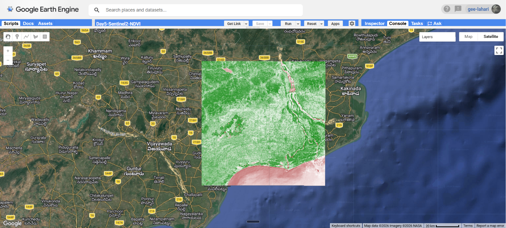

# Day 5 — Sentinel-2 True Color and NDVI

## What I did

Loaded a real Sentinel-2 satellite image of West Godavari district using Google Earth Engine.
Visualized it as a true color image (RGB) and computed NDVI to map vegetation health.

## Region

West Godavari district, Andhra Pradesh — coordinates (81.1, 16.9)

## Code

### 1. Define region and center map

```javascript
var point = ee.Geometry.Point([81.1, 16.9]);
Map.centerObject(point, 10);
```

### 2. Load Sentinel-2 image

```javascript
var sentinel = ee
  .ImageCollection("COPERNICUS/S2_SR_HARMONIZED")
  .filterBounds(point)
  .filterDate("2024-01-01", "2024-12-31")
  .filter(ee.Filter.lt("CLOUDY_PIXEL_PERCENTAGE", 10))
  .first();
```

### 3. Display true color (RGB)

```javascript
Map.addLayer(
  sentinel,
  { bands: ["B4", "B3", "B2"], min: 0, max: 3000 },
  "True Color",
);
```

### 4. Compute and display NDVI

```javascript
var ndvi = sentinel.normalizedDifference(["B8", "B4"]);
Map.addLayer(
  ndvi,
  { min: -1, max: 1, palette: ["brown", "white", "green"] },
  "NDVI",
);
```

## Key concepts

- B4 = Red, B3 = Green, B2 = Blue, B8 = NIR
- NDVI = (NIR - Red) / (NIR + Red)
- Green pixels = healthy vegetation (rice paddies)
- Brown/pink pixels = water bodies (Godavari river)
- min/max in addLayer controls display brightness, not the data itself


